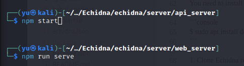

# Echidna: Penetration Test Assist & Collaboration Tool


Echidna visualizes and shares the attack of each penetration tester, and recommends the next action based on the knowledge stored in the database.


Please see the youtube video below to see the features of Echidna.
https://www.youtube.com/@Echidna0801


## Echidna Repository

https://github.com/Echidna-Pentest/Echidna/

## Components

There are two Echidna servers and an Echidna command.

- API server: services to access data storage
- Web server: GUI web service to access the API server
- CLI command: CLI command to access the API server

## How to start Echidna servers

There are two ways to start the servers.

- Install Node.js
- Start the servers on your Kali Linux system.
- Start the servers in docker containers on your Linux system.

Execute "sudo install.sh", or execute the commands below to install manually. 

### Install Node.js

```console
$ sudo apt-get -y update
$ sudo apt-get -y dist-upgrade
$ sudo apt-get -y install kali-linux-headless nodejs npm
$ sudo npm install -g n
$ sudo n node/16.17.0
$ sudo apt-get -y purge nodejs npm
$ sudo apt-get -y autoremove
$ sudo apt-get clean
```

### Start Echidna servers on your Kali Linux system

1. Clone Echidna repository
2. Start Echidna API server
3. Start Echidna Web server
4. access to the Echidna using a web browser

```console
$ git clone https://github.com/Echidna-Pentest/Echidna
$ cd echidna/lib
$ npm install
$ cd ../server/api_server
$ npm install
$ npm start &
$ cd ../web_server
$ npm install
$ npm run serve &
```




### Start Echidna servers in docker containers on your Linux system

You need to install docker-compose on your Linux system

```console
$ sudo apt install docker-compose
```

1. Clone Echidna repository
2. Build docker containers using docker-compose command
3. Start Echidna Web server
4. access to the Echidna web using a web browser

```console
$ git clone https://.../echidna.git
$ sudo docker-compose build
$ sudo docker-compose up -d
$ docker images
REPOSITORY               TAG       IMAGE ID       CREATED          SIZE
echidna_web              latest    70c2aab7c813   17 seconds ago   633MB
echidna_api              latest    f55f2b69ba81   2 minutes ago    8.76GB
kalilinux/kali-rolling   latest    5eb4e474175c   3 weeks ago      121MB
node                     16-slim   572389d8c38d   4 weeks ago      179MB
```

### How to use Echidna

You can use Echidna with a web browser.

```text
http://localhost:8080/
```

Once you have successfully accessed Echidna from the web, use one of the commands below to add the target IP address and port number to the target tree.

- ping target_ip
- nmap target_ip
- ip -4 neigh (if the target ip address is already added to ARP table)

Once the target information has been added to the tree, select that target from the target tree. 
Depending on which ports are open, the commands to be executed next will be displayed in the Candidate Command component, so click on them.
The command displayed in the Candidatre Command component changes depending on the target selection, such as selecting the IP address of the host, selecting port 21, selecting port 80, etc, so please select various target nodes at first.


Please see the youtube video below to see how to exploit vulnerable machines (Blue, Jerry, Stapler) with Echidna.
https://www.youtube.com/@Echidna0801


<!--
### CLI command access

You need to install node version 16

```console
$ cd echidna/client/cli
$ npm install
$ node echidna.js
```
-->

## Files in Echidna repository

| directory | contents | language | requirements |
| :--- | :--- | :--- | :--- |
| client/cli | Echidna command | JavaScript | Node.js |
| client/wpf | Echidna GUI | C# | Windows OS |
| docs | documents | OpenAPI yaml | Swagger |
| lib | Echidna API library | JavaScript | Node.js |
| server/EchidnaAPIServer | Echidna API Server | JavaScript | Node.js |
| server/EchidnaAPITest | test for Echidna API Server | C# | VisualStudio |
| server/EchidnaWebServer | Echidna Web Server | Vue.js | Node.js |


## Features


### Terminal Sharing
Anyone can access the terminal from any device (Windows/Mac/Linux/Tablet) over http and share the command outputs with others.


### Target Information Extraction
Extract command output results and automatically reflect them in the Target Tree Component.
Implementing a parser script for each command is required to reflect the terminal output in Target Tree Component (echidna/server/api_server/commands/*.py).

Parser scripts for the below commands are implemented currently.
- Scan commands (commands to use before initial shell)
  
  dirb, hydra, ip addr, ip neigh, nikto, nmap, ping, smbmap, wpscan

- Privilege escalation commands (commands to use after the initial shell)

  cat, dirb, find, linux-smart-enumeration, netstat, ps, uname


### Command Suggest
Suggest candidate commands based on the selected target tree node or current situation. 

Example)
- http (port 80) service added and selected in Target tree - > show HTTP scan commands (nikto, wpscan, dirb, sqlmap, etc) in the Candidate Command component.
- Vulnerable services like vsftpd 2.3.4 added and selected in Target tree -> show exploit command for vsftpd 2.3.4.
- Reverse shell is established with target terminal - > show commands for privilege escalation (find, netstat, uname, etc)

Adding the below format in commands.txt is required to display them in the Candidate Command component. 
The items (host, ipv4) enclosed in "{}" in the template are automatically replaced with the target information registered in the target tree.
The condition item is set according to the desired conditions to display in the candidate command. In the example below, since the whatweb command is used for investigating web services, we define the condition item as "http" and "80".

- echidna/server/api_server/commands/commands.txt

```
[Echidna]
pattern: any command is fine since no parser script
name: WhatWeb identifies websites. It recognizes web technologies including content management systems (CMS), blogging platforms, statistic/analytics packages, JavaScript libraries, web servers, and embedded devices.
template: whatweb -v -a3 {ipv4}
template: whatweb -v -a3 {host}
condition: {".*": ["http", "80"]}
group: HTTP
[end]
```


Currently, approximately 100 commands are registered.
Ex) 
- Scan commands (commands to use before initial shell)

whatweb, smbclient, smtp_version enum command, enum command for rpc, etc

- Exploit Commands

ms17-010, exploit for vsftpd 2.3.4, HttpFileServer 2.3.x, tomcat, sqlmap, etc

- Login Commands

ftp, ssh, crackmapexec, vncviewer, telnet, rlogin, etc

- Privilege escalation commands (commands to use after the initial shell)

meterpreter related commands, spawn shell commands


### Target Tree Export
Export the contents of the Target Tree to md file by clicking the export button of the target tree.


### Chat
Share text messages with others by clicking the Chat button at the bottom right of the home window.
If you add @AI at the top, ChatGPT analyzes the message to see some vulnerabilities.
Analysis results are returned through the chat component. 


### Exploit code search 
When a "Version" node is registered in the Target Tree, Exploit codes are automatically searched and added to the Target Tree. 
In the figure below, the vulnerable version of vsftpd 2.3.4 was registered in the target tree. Therefore, Echidna automatically searched for the exploit codes and registered the exploit codes in the target tree.


### Graph 
You can view the target tree graphically by clicking the Graph button in the navigation bar


### Target Tree Analysis (Under Development)
Analyze Target Tree and highlight them if some critical vulnerabilities are found and display the Machine having the same vulnerability in the Hack The Box.

Example)
- "vsftpd 2.3.4" added in Target tree -> highlighted and a popup displays "Similar machine is HackTheBox Lame".
- "Anonymous FTP login allowed" added in Target tree -> highlighted and a popup displays "Similar machine is HackTheBox Devel".
- "smb-vuln-ms17-010" added in Target tree -> highlighted and a popup displays "Similar machine is HackTheBox Legacy"


if "AIAnalysis" property is true  and the API key of ChatGPT is set in the configuration file (echidna.json), the target tree is analyzed automatically and the analysis result can be displayed in the chat.

### Authentication (Under Development)

If you use Echidna in an environment where anyone can access it instead of locally, please use the authentication function. The authentication feature is enabled by setting the AuthRequired parameter to true in the following configuration file.

- echidna/server/web_server/echidna.json

The default user is 'user=root, password=Echidna123#', and you can change the password by writing the bcrypt-encrypted password in the file below. You can generate bcrypt hashed passwords by sites such as https://bcrypt-generator.com/

- echidna/server/api_server/users.json

## Operation check environment
- OS: Kali Linux 2023.2


## Points to Note
### Terminal Size

The terminal size is calculated based on the window size when you click the terminal tab. If the terminal size doesn't fit, please click the terminal tab button again or reload the browser.

### Incompatible Commands

Echidna is not compatible with commands like dirb, which generate a large amount of output to display progress in the terminal because Echidna saves all terminal outputs in a log file. 
Please use the silent option (-S) to use dirb command in Echidna.


## Contributing

See the [Contributing](CONTRIBUTING.md).

## License

This software is licensed under [Apache License Version 2.0](https://www.apache.org/licenses/LICENSE-2.0)

* Copyright (c) 2023-2024, Fujitsu Defense & National Security Limited.


## Caution
THIS SOFTWARE IS CREATED ONLY FOR THE SECURITY TRAINING PURPOSE SUCH AS RED TEAM OPERATION AND ENGINEER SKILL CHECK. THE USER SHALL NOT USE THIS SOFTWARE FOR THE ATTACKING ON THE THIRD PARTY SYSTEM.
THE SOFTWARE IS PROVIDED “AS IS” AND THE AUTHOR DISCLAIMS ALL WARRANTIES WITH REGARD TO THIS SOFTWARE INCLUDING ALL IMPLIED WARRANTIES OF MERCHANTABILITY AND FITNESS FOR A PARTICULAR PURPOSE. IN NO EVENT SHALL THE AUTHOR BE LIABLE FOR ANY SPECIAL, DIRECT, INDIRECT, OR CONSEQUENTIAL DAMAGES OR ANY DAMAGES WHATSOEVER RESULTING FROM LOSS OF USE, DATA OR PROFITS, WHETHER IN AN ACTION OF CONTRACT, NEGLIGENCE OR OTHER TORTIOUS ACTION, ARISING OUT OF OR IN CONNECTION WITH THE USE OR PERFORMANCE OF THIS SOFTWARE.

