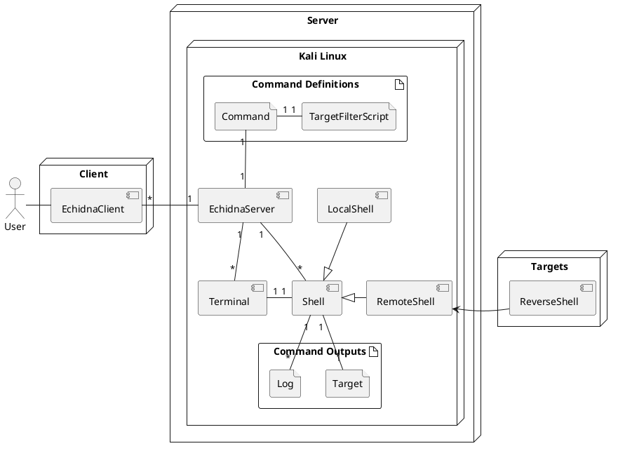
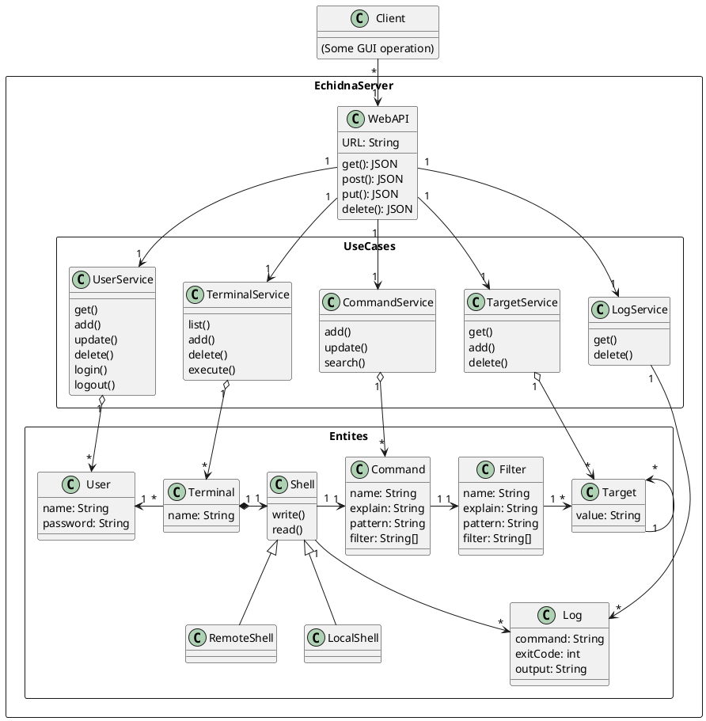
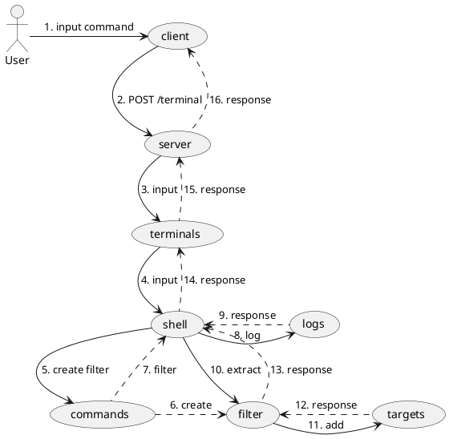

###### tags: `RedTeamStudio` `Echidna`

## Echidna System Diagrams

### package diagram

```plantuml
@startuml
actor User
node Client {
    component EchidnaClient
}
User -right- EchidnaClient
node Server {
    node "Kali Linux" {
        component EchidnaServer
        component Terminal
        component Shell
        component LocalShell
        component RemoteShell
        artifact  "Command Outputs" {
            file Log
            file Target
        }
        artifact "Command Definitions" {
            file Command
            file TargetFilterScript
            EchidnaServer "1" -up- "1" Command
            Command "1" -right- "1" TargetFilterScript
        }
        EchidnaServer "1" -down- "*" Terminal
        Terminal "1" -right- "1" Shell
        Shell "1" -down- "*" Log
        Shell "1" -right- "1" Target
    }
}
EchidnaClient "*" -right- "1" EchidnaServer
node Targets {
    component ReverseShell
}
EchidnaServer "1" -right- "*" Shell
Shell <|-up- LocalShell
Shell <|-right- RemoteShell
RemoteShell <- ReverseShell

@enduml
```

### class diagram

```plantuml
@startuml
class Client {
    {method}(Some GUI operation)
}
Rectangle "EchidnaServer" {
    class WebAPI {
        URL: String
        {method} get(): JSON
        {method} post(): JSON
        {method} put(): JSON
        {method} delete(): JSON
    }
    Rectangle "UseCases" {
        class TerminalService {
            {method} list()
            {method} add()
            {method} delete()
            {method} execute()
        }
        class UserService {
            {method} get()
            {method} add()
            {method} update()
            {method} delete()
            {method} login()
            {method} logout()
        }
        class CommandService {
            {method} add()
            {method} update()
            {method} search()
        }
        class LogService {
            {method} get()
            {method} delete()
        }
        class TargetService {
            {method} get()
            {method} add()
            {method} delete()
        }
    }
    Rectangle "Entites" {
        class User {
            name: String
            password: String
        }
        class Terminal {
            name: String
        }
        class Shell {
            {method} write()
            {method} read()
        }
        class LocalShell {
        }
        class RemoteShell {
        }
        class Log {
            command: String
            exitCode: int
            output: String
        }
        class Command {
            name: String
            explain: String
            pattern: String
            filter: String[]
        }
        class Filter {
            name: String
            explain: String
            pattern: String
            filter: String[]
        }
        class Target {
            value: String
        }
    }
}

Client "*" -down-> "1" WebAPI
WebAPI "1" -down-> "1" UserService
WebAPI "1" -down-> "1" CommandService
WebAPI "1" -down-> "1" TargetService
WebAPI "1" -down-> "1" TerminalService
WebAPI "1" -down-> "1" LogService
UserService "1" o-down-> "*" User
TerminalService "1" o-down-> "*" Terminal
CommandService "1" o-down->  "*" Command
LogService "1" -down-> "*" Log
TargetService "1" o-down-> "*" Target
Terminal "*" -left-> "1" User
Terminal "1" *-right-> "1" Shell
Shell <|-down- LocalShell
Shell <|-down- RemoteShell
Shell "1" -right-> "1" Command
Shell "1" -down-> "*" Log
Command "1" -right-> "1" Filter
Filter "1" -right-> "*" Target
Target "1" -up-> "*" Target

@enduml
```

### collabolation diagram

```plantuml
@startuml
actor User
User -> (client) : 1. input command
(client) --> (server) : 2. POST /terminal
(server) --> (terminals) : 3. input
(terminals) --> (shell) : 4. input
(shell) --> (commands) :  5. create filter
(commands) .> (filter) : 6. create
(shell) <.. (commands) : 7. filter
(shell) -> (logs) : 8. log
(shell) <. (logs) : 9. response
(shell) --> (filter) : 10. extract
(filter) -> (targets) : 11. add
(filter) <. (targets) : 12. response
(shell) <.. (filter) : 13. response
(terminals) <.. (shell) : 14. response
(server) <.. (terminals) : 15. response
(client) <.. (server) : 16. response
@enduml
```

